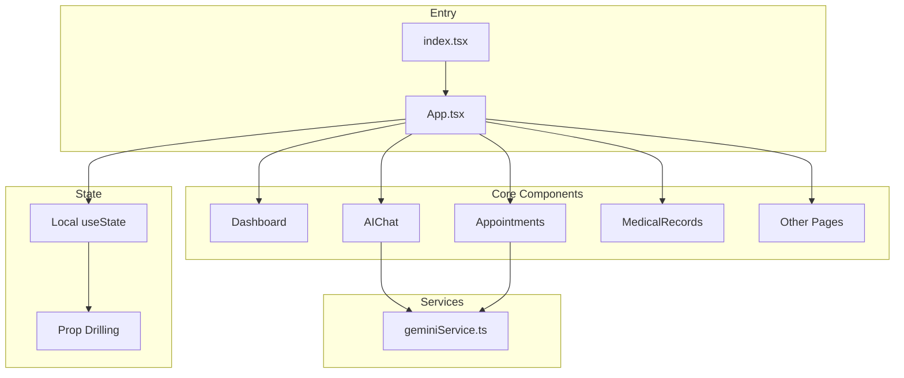
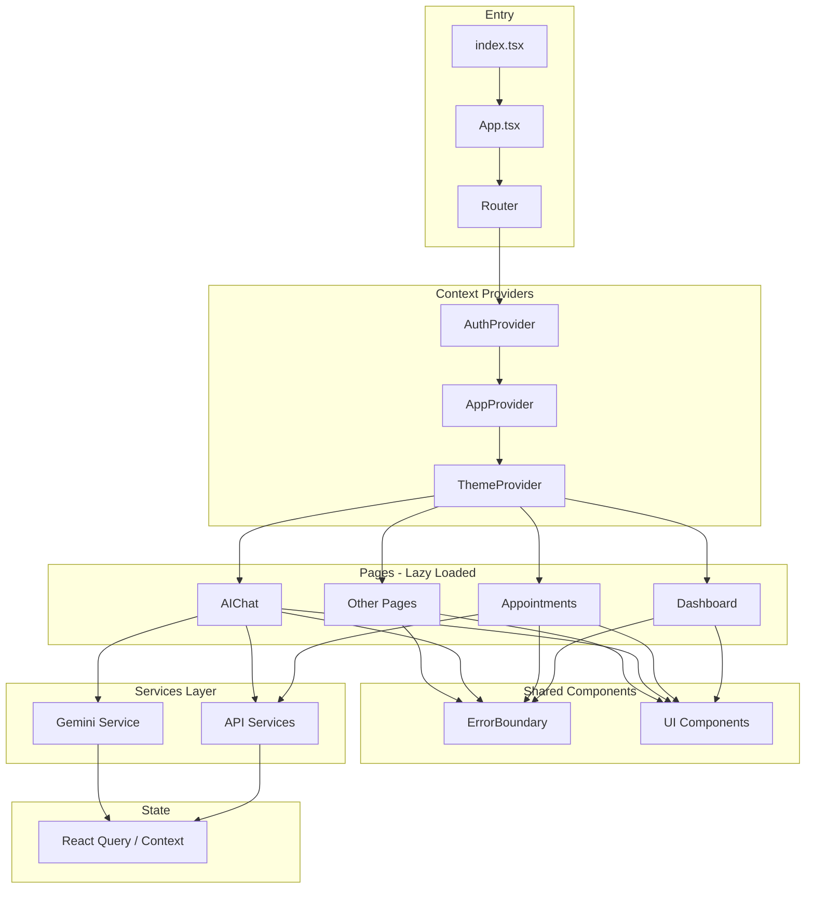

# Arya Hospital Portal 2.0 - Architecture Analysis & Improvement Plan

## Executive Summary

This document outlines a comprehensive improvement plan for the Arya Hospital Portal 2.0 application. The analysis identified several architectural concerns and opportunities for enhancement across code organization, state management, performance, and developer experience.

---

## Current Architecture Overview



### Technology Stack
- **Framework**: React 19.2.4 with TypeScript 5.8.2
- **Build Tool**: Vite 6.2.0
- **Styling**: Tailwind CSS 4.1.18
- **AI Integration**: Google GenAI SDK
- **Charts**: Recharts 3.7.0
- **Icons**: Lucide React

---

## Key Findings & Issues

### 1. Critical: Oversized Component Files

| File | Size | Concern Level |
|------|------|---------------|
| [`components/Appointments.tsx`](components/Appointments.tsx) | 88,871 chars | 🔴 Critical |
| [`components/VerificationModal.tsx`](components/VerificationModal.tsx) | 31,097 chars | 🟠 High |
| [`components/AIChat.tsx`](components/AIChat.tsx) | 18,559 chars | 🟠 High |
| [`App.tsx`](App.tsx) | 15,972 chars | 🟡 Medium |

**Impact**: Hard to maintain, test, and understand. Violates Single Responsibility Principle.

### 2. No Global State Management

Current state handling uses prop drilling:
- User state managed in [`App.tsx`](App.tsx:79)
- Appointments passed through multiple levels
- No centralized state for cross-cutting concerns

### 3. Mock Data Scattered Throughout Codebase

Mock data defined in multiple locations:
- [`App.tsx`](App.tsx:23-75): User, appointments, lab results, medications, bills
- [`components/Appointments.tsx`](components/Appointments.tsx:17-95): Doctors, services, slots
- Each component contains its own mock data

### 4. Custom View State Instead of Routing

```typescript
// Current approach in App.tsx
const [currentView, setCurrentView] = useState<ViewState>('dashboard');
```

No URL-based navigation means:
- No deep linking capability
- No browser history support
- Poor SEO and shareability

### 5. Missing Error Boundaries

No error boundaries detected to gracefully handle component failures.

### 6. No Testing Infrastructure

No test files or testing framework configuration found.

### 7. Type Safety Issues

Several instances of `any` type usage:
- [`App.tsx:135`](App.tsx:135): `onNavigate={(view: any) => setCurrentView(view)}`
- [`App.tsx:147`](App.tsx:147): Same pattern

### 8. Accessibility Concerns

Need to verify:
- ARIA labels for interactive elements
- Keyboard navigation support
- Screen reader compatibility

---

## Improvement Plan

### Phase 1: Code Organization & Component Refactoring

#### 1.1 Split Appointments Component

Break down the 88KB [`Appointments.tsx`](components/Appointments.tsx) into smaller, focused modules:

```
components/
├── appointments/
│   ├── index.tsx              # Main container
│   ├── AppointmentList.tsx    # List view
│   ├── AppointmentCard.tsx    # Individual card
│   ├── BookingFlow/
│   │   ├── BookingWizard.tsx  # Main booking flow
│   │   ├── DoctorSelection.tsx
│   │   ├── TimeSlotPicker.tsx
│   │   └── BookingConfirmation.tsx
│   ├── types.ts               # Appointment-specific types
│   └── constants.ts           # Mock data and constants
```

#### 1.2 Extract Verification Modal Components

Split [`VerificationModal.tsx`](components/VerificationModal.tsx) into:
- `VerificationModal/index.tsx` - Main container
- `VerificationModal/Steps/` - Individual step components
- `VerificationModal/hooks.ts` - Step navigation logic

#### 1.3 Create Component Library Structure

```
components/
├── ui/                        # Reusable UI primitives
│   ├── Button/
│   ├── Card/
│   ├── Modal/
│   ├── Input/
│   └── index.ts
├── layout/                    # Layout components
│   ├── Sidebar/
│   ├── Header/
│   └── PageLayout/
├── features/                  # Feature-based components
│   ├── appointments/
│   ├── chat/
│   ├── records/
│   └── pharmacy/
└── shared/                    # Shared utilities
    ├── LockedView.tsx
    └── ErrorBoundary.tsx
```

### Phase 2: State Management Implementation

#### 2.1 Implement React Context + Custom Hooks

Create a lightweight state management solution:

```typescript
// contexts/AppContext.tsx
interface AppContextType {
  user: User;
  appointments: Appointment[];
  notifications: NotificationItem[];
  // Actions
  updateUser: (user: Partial<User>) => void;
  addAppointment: (appointment: Appointment) => void;
}
```

#### 2.2 Create Feature-Specific Contexts

```
contexts/
├── AppContext.tsx        # Global app state
├── AuthContext.tsx       # Authentication state
├── ThemeContext.tsx      # Theme preferences
└── NotificationContext.tsx # Toasts and alerts
```

### Phase 3: Data Layer Improvements

#### 3.1 Centralize Mock Data

```
data/
├── mock/
│   ├── users.ts
│   ├── appointments.ts
│   ├── doctors.ts
│   ├── medications.ts
│   └── index.ts
└── constants/
    ├── specialties.ts
    ├── timeSlots.ts
    └── index.ts
```

#### 3.2 Create API Service Layer

```
services/
├── api/
│   ├── base.ts           # Axios/fetch wrapper
│   ├── appointments.ts   # Appointment API
│   ├── auth.ts           # Authentication API
│   └── index.ts
├── geminiService.ts      # Existing AI service
└── index.ts
```

### Phase 4: Routing Implementation

#### 4.1 Add React Router

```typescript
// router/index.tsx
import { createBrowserRouter } from 'react-router-dom';

const router = createBrowserRouter([
  { path: '/', element: <Dashboard /> },
  { path: '/appointments', element: <Appointments /> },
  { path: '/appointments/:id', element: <AppointmentDetail /> },
  { path: '/chat', element: <AIChat /> },
  // ... other routes
]);
```

#### 4.2 Implement Route Guards

```typescript
// components/auth/ProtectedRoute.tsx
const ProtectedRoute = ({ children, requiresVerification }) => {
  const { user, isAuthenticated } = useAuth();
  
  if (!isAuthenticated) return <Navigate to="/login" />;
  if (requiresVerification && !user.isVerified) {
    return <Navigate to="/verify" />;
  }
  
  return children;
};
```

### Phase 5: Error Handling & Resilience

#### 5.1 Add Error Boundaries

```typescript
// components/shared/ErrorBoundary.tsx
class ErrorBoundary extends React.Component {
  // Implementation with fallback UI
}
```

#### 5.2 Implement Global Error Handling

- API error interceptors
- Toast notifications for errors
- Graceful degradation patterns

### Phase 6: Testing Infrastructure

#### 6.1 Setup Testing Framework

```json
// package.json additions
{
  "devDependencies": {
    "@testing-library/react": "^14.x",
    "@testing-library/jest-dom": "^6.x",
    "vitest": "^1.x",
    "@vitest/coverage-v8": "^1.x"
  }
}
```

#### 6.2 Create Test Structure

```
__tests__/
├── unit/
│   ├── components/
│   └── services/
├── integration/
│   └── flows/
└── e2e/
    └── critical-paths/
```

### Phase 7: Performance Optimization

#### 7.1 Code Splitting

```typescript
// Lazy load heavy components
const Appointments = lazy(() => import('./components/appointments'));
const AIChat = lazy(() => import('./components/chat'));
```

#### 7.2 Memoization Strategy

- Use `React.memo` for frequently re-rendering components
- Implement `useMemo` for expensive computations
- Add `useCallback` for event handlers passed to children

#### 7.3 Bundle Analysis

Add bundle analyzer to identify optimization opportunities.

### Phase 8: Accessibility Improvements

#### 8.1 Audit Current State

- Run Lighthouse accessibility audit
- Test with screen readers
- Verify keyboard navigation

#### 8.2 Implement Fixes

- Add ARIA labels and roles
- Ensure focus management
- Implement skip links
- Add keyboard shortcuts documentation

---

## Proposed Architecture



---

## Implementation Priority Matrix

| Priority | Task | Impact | Effort |
|----------|------|--------|--------|
| 🔴 P0 | Split Appointments component | High | Medium |
| 🔴 P0 | Add Error Boundaries | High | Low |
| 🟠 P1 | Implement Context-based state | High | Medium |
| 🟠 P1 | Centralize mock data | Medium | Low |
| 🟡 P2 | Add React Router | Medium | Medium |
| 🟡 P2 | Setup testing infrastructure | High | Medium |
| 🟢 P3 | Performance optimization | Medium | Medium |
| 🟢 P3 | Accessibility audit & fixes | Medium | Medium |

---

## File Structure After Refactoring

```
arya-hospital-portal-2.0/
├── src/
│   ├── components/
│   │   ├── ui/                    # Reusable primitives
│   │   ├── layout/                # Layout components
│   │   ├── features/              # Feature-based components
│   │   └── shared/                # Shared utilities
│   ├── contexts/                  # React contexts
│   ├── hooks/                     # Custom hooks
│   ├── services/                  # API and external services
│   ├── data/                      # Mock data and constants
│   ├── types/                     # TypeScript types
│   ├── utils/                     # Utility functions
│   └── __tests__/                 # Test files
├── public/
├── plans/                         # Planning documents
└── configuration files
```

---

## Next Steps

1. **Review this plan** and provide feedback on priorities
2. **Approve the approach** or suggest modifications
3. **Switch to Code mode** to begin implementation
4. **Start with P0 tasks** for immediate impact

---

## Questions for Discussion

1. Should we use React Query for server state management, or keep it simple with Context?
2. Do you want to maintain backward compatibility during refactoring?
3. Are there any specific performance concerns or metrics to target?
4. What is the deployment strategy - can we deploy incrementally?
